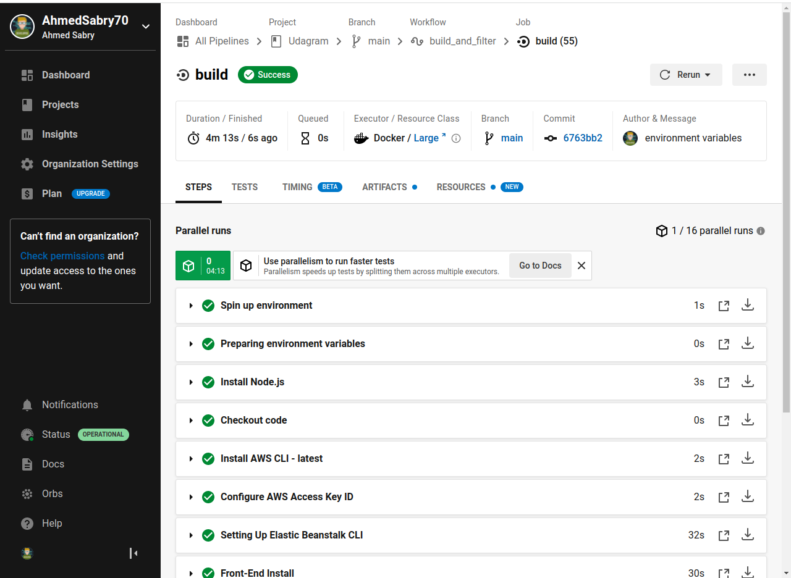
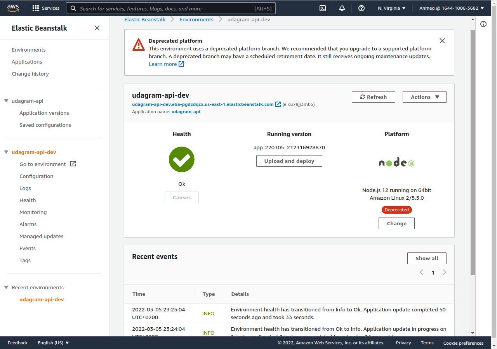

# Udagram

This application is provided as starter project [Github:UDAGRAM](https://github.com/udacity/nd0067-c4-deployment-process-project-starter) which is a part of the Udacity FullStack JavaScript nanodegree requirements. to employ and adapt the code to

- Configure the services and infrastructure on AWS
- Create scripts to deploy each component of the application
- Create and document an automated pipeline using CircleCI
  and make sure it working and hosted on AWS.

The project is available at live preview

> REQ: Provide the link to your hosted working Front-End Application in the README ==>

http://udagram-frontend-udacity-g5.s3-website-us-east-1.amazonaws.com

See additional documentation in the documentation folder. :

- Dependencies
  [dependencies.md](./docs/dependencies.md)
- Infrastructure
  [Infrastructure.md](./docs/infrastructure.md)
- Pipeline
  [Pipeline.md](docs/pipeline.md)

> **Include a screenshot of your last build in CircleCi :**

### CircleCI Pipeline

> **Include screenshots of the configuration page of your AWS services:**

## Configuration Screenshots

**PostgreSQL RDS database**

**Elastic Beanstalk Environment**

**FrontEnd S3 Bucket**

**Media S3 Bucket**

**Architecture**

## Getting Started

### Project Environment

**Local Machine Instructions**

1. ✔️ Clone this repo locally into the location of your choice.
1. ✔️ Move the content of the udagram folder at the root of the repository as this will become the main content of the project.
1. ✔️ Open a terminal and navigate to the root of the repo
1. ✔️ follow the instructions in the installation step

Ensure you have the following installed:

- Node v14.15.1 (LTS), or more recent. While older versions can work, it is advisable to keep Node to the latest LTS version
- npm 6.14.8 (LTS), or more recent. Yarn can work but was not tested for this project
- AWS CLI v2, v1 can work but was not tested for this project
- AWS EB CLI

**Installation Local Machine Instructions to(DEV ENV)**

Provision the necessary AWS services needed for running the application:

1. ✔️ In AWS, provision a publicly available RDS database running Postgres.

1. ✔️ In AWS, provision a s3 bucket for hosting the uploaded files.

1. ✔️ Export the ENV variables needed or use a package like [dotnev](https://www.npmjs.com/package/dotenv)/.

1. ✔️ From the root of the repo, navigate udagram-api folder `cd starter/udagram-api` to install the node_modules `npm install`. After installation is done start the api in dev mode with `npm run dev`.

1. ✔️ Without closing the terminal in step 1, navigate to the udagram-frontend `cd starter/udagram-frontend` to intall the node_modules `npm install`. After installation is done start the api in dev mode with `npm run start`.

## Testing

This project contains two different test suite: unit tests and End-To-End tests(e2e). Follow these steps to run the tests.

1. `cd starter/udagram-frontend`
1. `npm run test`
1. `npm run e2e`

There are no Unit test on the back-end

### Unit Tests:

Unit tests are using the Jasmine Framework.

### End to End Tests:

The e2e tests are using Protractor and Jasmine.

## Built With

- [Angular](https://angular.io/) - Single Page Application Framework
- [Node](https://nodejs.org) - Javascript Runtime
- [Express](https://expressjs.com/) - Javascript API Framework

## License

[License](LICENSE.txt)
