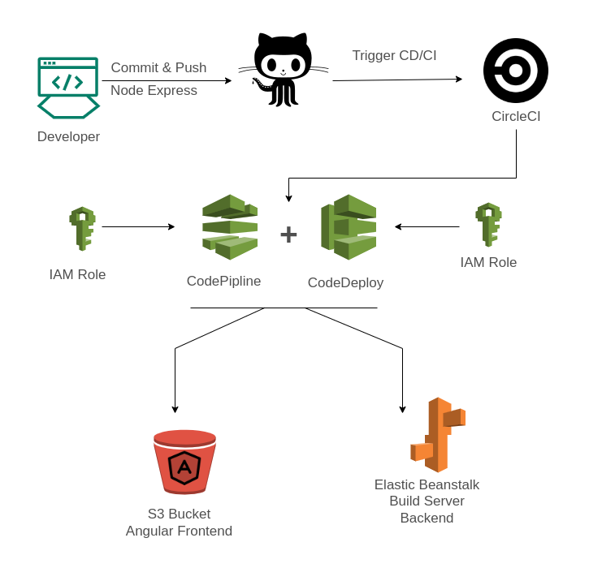

## Udagram Pipeline Process

\
**GitHub**

- The developers commit and push their code to the - GitHub repository which is linked to the CircleCI platform.
- GitHub triggers the CircleCI platform when code is pushed to the repository.

\
**CircleCI**

- CircleCI reads the `.circleci/config.yml` file which tells the service what has to be done. In the case of Udagram,
- there are 2 jobs (frontend & server) to be run by CircleCI.

**Order of commands**

1. The pipeline uses orbs to install:
   - node: node: circleci/node@5.0.0
   - aws-cli: circleci/aws-cli@2.1.0
   - eb: circleci/aws-elastic-beanstalk@2.0.1
2. It checks out the code from the repo
3. Frontend Steps
   - FrontEnd install
   - FrontEnd build
   - FrontEnd deploy
4. Backend Steps
   - Backend install
   - Backend build
   - Backend deploy
